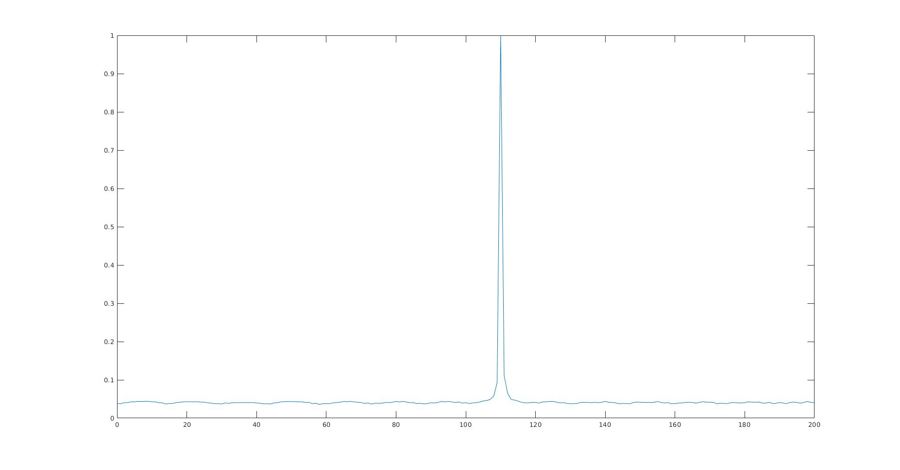
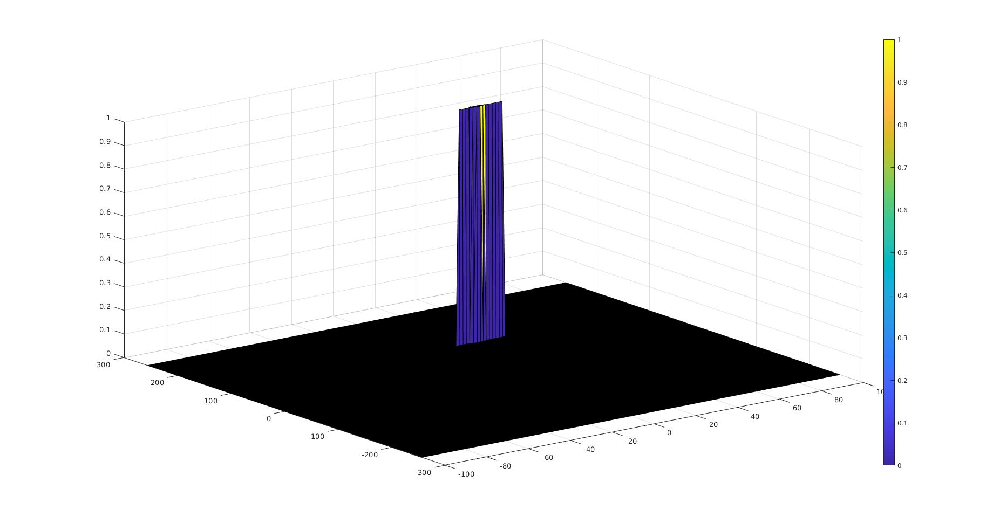

# SFND-Project4
Udacity Sensor Fusion Nanodegree - Project 4 - Radar Target Generation and Detection


- Configure the FMCW waveform based on the system requirements.
- Define the range and velocity of target and simulate its displacement.
- For the same simulation loop process the transmit and receive signal to determine the beat signal
- Perform Range FFT on the received signal to determine the Range
- Towards the end, perform the CFAR processing on the output of 2nd FFT to display the target.

**Project Overview**


**Radar System Requirements**


**FMCW Waveform Design**

*Using the given system requirements, design a FMCW waveform. Find its Bandwidth (B), chirp time (Tchirp) and slope of the chirp.*

The sweep bandwidth can be determined according to the range resolution and the sweep slope is calculated using both sweep bandwidth and sweep time.

> 


The sweep time can be computed based on the time needed for the signal to travel the unambiguous maximum range. In general, for an FMCW radar system, the sweep time should be at least 5 to 6 times the round trip time. This example uses a factor of 5.5.

>
>


Giving the slope of the chirp signal

>

***MATLAB CODE***
```cpp
% *%TODO* :
%Design the FMCW waveform by giving the specs of each of its parameters.
% Calculate the Bandwidth (B), Chirp Time (Tchirp) and Slope (slope) of the FMCW
% chirp using the requirements above.

B = c/2*delta_r; 
Tchirp = 5.5*(2*Rmax)/c;
slope = B/Tchirp;
```

​	

**Simulation Loop**

*Simulate Target movement and calculate the beat or mixed signal for every timestamp.*


Transmit Signal
>

Transmit Signal
>

> = delay time (trip time for signal)

Beat (mixed) Signal
>


***MATLAB CODE***
```cpp
    %*%TODO* :
    %For each time stamp update the Range of the Target for constant velocity. 

    r_t(i) = c*t(i)*fc/(2*B);   %range calcualtion

    td(i) = (R+t(i)*v)/c; %time delay - tau
    
    % *%TODO* :
    %For each time sample we need update the transmitted and
    %received signal. 
    Tx(i) = cos( 2 * pi * ( fc * t(i) + (slope * t(i)^2)/2)); 
    Rx(i) = cos( 2 * pi * ( fc * (t(i) - td(i)) + (slope * (t(i) - td(i))^2)/2)); 
    
    % *%TODO* :
    %Now by mixing the Transmit and Receive generate the beat signal
    %This is done by element wise matrix multiplication of Transmit and
    %Receiver Signal
    Mix(i) = Tx(i)*Rx(i);
```


**Range FFT (1st FFT)**


*Implement the Range FFT on the Beat or Mixed Signal and plot the result.*
- Implement the 1D FFT on the Mixed Signal
- Reshape the vector into Nr*Nd array.
- Run the FFT on the beat signal along the range bins dimension (Nr)
- Normalize the FFT output.
- Take the absolute value of that output.
- Keep one half of the signal
- Plot the output



***MATLAB CODE***

```cpp
% *%TODO* :
%reshape the vector into Nr*Nd array. Nr and Nd here would also define the size of
%Range and Doppler FFT respectively.
beat_signal = reshape(Mix, [Nr, Nd]);

 % *%TODO* :
%run the FFT on the beat signal along the range bins dimension (Nr) and
%normalize.
fft_signal = fft(beat_signal)/Nr;
 % *%TODO* :
% Take the absolute value of FFT output
fft_abs = abs(fft_signal);
 % *%TODO* :
% Output of FFT is double sided signal, but we are interested in only one side of the spectrum.
% Hence we throw out half of the samples.
P1  = fft_abs(1:Nr/2) ;

%plotting the range
figure ('Name','Range from First FFT')
%subplot(2,1,1)

 % *%TODO* :
 % plot FFT output 
f = Nr / length(P1) * (0 : (Nr / 2 - 1));
plot(f,P1);
axis ([0 200 0 0.5]);
```


**2D CFAR**


*Implement the 2D CFAR process on the output of 2D FFT operation, i.e the Range Doppler Map.*


- *Implementation steps for the 2D CFAR process.*
    - Determine the number of Training cells / Guard cells for each dimension. 
    
    - Slide the cell under test across the complete matrix. Make sure the CUT has margin for Training and Guard cells from the edges.
    
    - For every iteration sum the signal level within all the training cells. To sum convert the value from logarithmic to linear using db2pow function.
    - Average the summed values for all of the training cells used. After averaging convert it back to logarithmic using pow2db.
    - Further add the offset to it to determine the threshold.
    - Next, compare the signal under CUT against this threshold.
    - If the CUT level > threshold assign it a value of 1, else equate it to 0

***MATLAB CODE***

```cpp
for i = Tr+Gr+1 : Nr/2-(Gr+Tr)  %range index
    for j = Td+Gd+1 : Nd-(Gd+Td)  %doppler index
        
        noise_level = zeros(1,1);
        
        for p = i-(Tr+Gr) : i+Tr+Gr
            for q = j-(Td+Gd) : j+Td+Gd
                
                if (abs(i-p)>Gr || abs(j-q)>Gd)
                    %For every iteration sum the signal level within all the training cells
                    %To sum convert the value from logarithmic to linear using db2pow function
                    noise_level = noise_level + db2pow(RDM(p,q));
                end
            end
        end
        
        %Average the summed values for all of the training cells used   
        %After averaging convert it back to logarithmic
        threshold = pow2db(noise_level/(2*(Td+Gd+1)*2*(Tr+Gr+1)-(Gr*Gd)-1)); 
        % add the offset to it to determine the threshold
        threshold = threshold + offset; 
        
        % Use RDM[x,y] as the matrix from the output of 2D FFT for implementing
        % CFAR   
        %compare the signal under CUT against this threshold
        %If the CUT level > threshold assign it a value of 1, else equate it to 0.
        CUT = RDM(i,j);
        if(CUT < threshold)
            RDM(i,j)=0;
        else 
            RDM(i,j)=1;
        end
    end
end
```


- *Selection of Training, Guard cells and offset.*


***MATLAB CODE***

```cpp
% *%TODO* :
%Select the number of Training Cells in both the dimensions.
Tr = 10;
Td = 8;

% *%TODO* :
%Select the number of Guard Cells in both dimensions around the Cell under 
%test (CUT) for accurate estimation
Gr = 4;
Gd = 4;

% *%TODO* :
% offset the threshold by SNR value in dB
offset = 10;
% *%TODO* :
%Create a vector to store noise_level for each iteration on training cells
noise_level = zeros(1,1);
```


- *Steps taken to suppress the non-thresholded cells at the edges.*

***MATLAB CODE***

```cpp
RDM(RDM~=1) = 0; % set all non 1 values to zero
```

